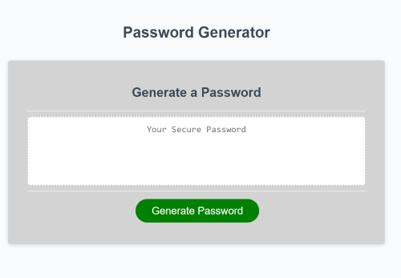

# Random Password Generator
This is an application designed to generate a random password based on the user's answers to various prompts regarding criteria.

### You will find in this application:
* On-click of "Generate Password" button, the user will be greated and asked a series of questions through alert, prompts, and confirm pop-ups.
* The application will use JavaScript to verify and store user's responses.
* The application will use JavaScript to combine variables, and return a random list of characters within perameters. 
* The final password will be displayed in the text-box within the HTML document.
* Lite styling has been applied, writen in JavaScript.

### Resources:
* W3Schools @ https://www.w3schools.com/
* Stack Overflow @ https://stackoverflow.com
* "Password Generator with Javascript" @ https://dev.to/olawanle_joel/password-generator-with-javascript-57c

### Links to access application:
* 

